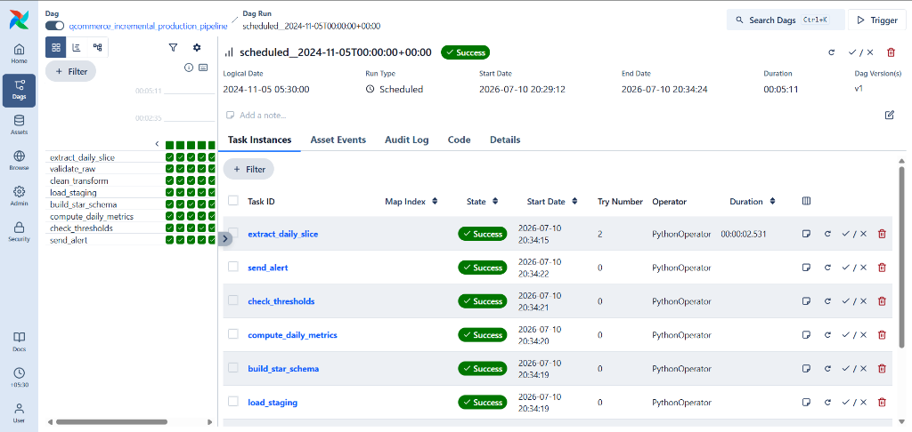
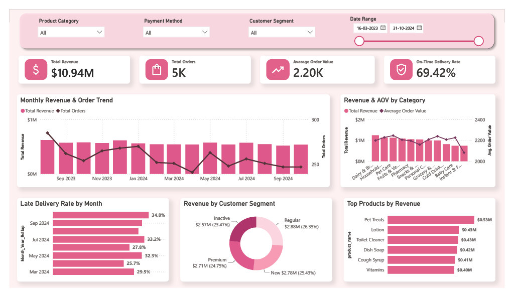
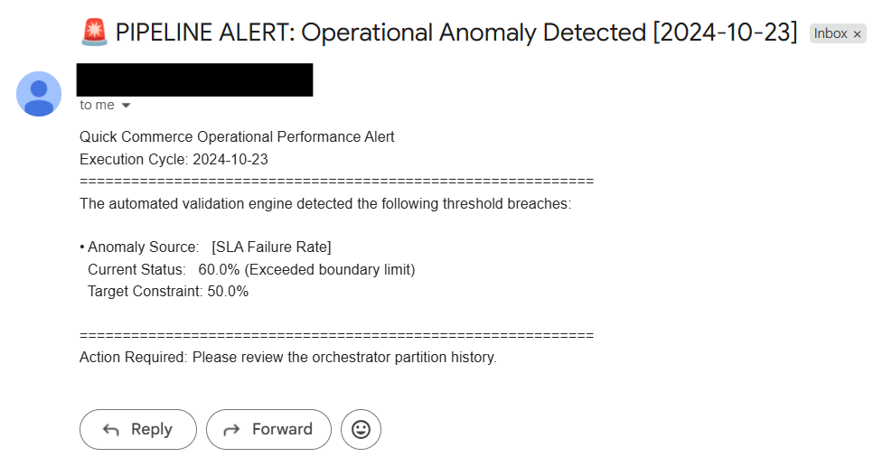

# Qcommerce Incremental E-Commerce Data Platform 🚀

A production-grade, stateful ELT data platform designed for an incremental quick-commerce operational infrastructure. This architecture orchestrates containerized ingestion pipelines, updates a structured regional data warehouse incrementally, enforces transactional data quality gates, and serves end-to-end operational insights via interactive business intelligence layers.

---

## 🏗️ System Architecture & Data Flow

The platform utilizes a structured multi-tier framework to isolate computing loads and guarantee data safety:

1. **Orchestration Engine**: Apache Airflow running in multi-container **Docker** environments handles isolated task states, task dependencies, and scheduled daily transaction replays.
2. **Storage Metastore**: A local **PostgreSQL** relational data warehouse holds operational data across a dedicated staging layer and an optimized Star Schema (Fact and Dimension tables).
3. **Data Quality Assurance**: Automatic programmatic validation nodes query daily metric slices against threshold boundaries to discover transactional anomalies and dispatch instant secure SMTP notifications during delivery anomalies.
4. **Business Intelligence**: An analytics layer built in **Power BI** mirrors data warehouse schemas to track fulfillment success, delivery delays, and category revenue performance.

### Pipeline Orchestration Workflow
The daily execution cycle is fully orchestrated through a direct acyclic graph (DAG) with explicit task dependencies, ensuring absolute consistency across staging and star schema layers:



---

## 📊 Core Analytical Insights & Reporting Layer

The final business intelligence reporting layer turns the processed operational schemas into actionable, high-impact retail metrics:



Based on the performance log lifecycle tracking from the production data warehouse layer:
* **Financial Performance**: The platform processed **$10.94M** in total revenue over a **5K** comprehensive order history.
* **Operational Quality**: Found a baseline **69.42% On-Time Delivery Rate**, tracking monthly late delivery anomalies fluctuating heavily near **34.8%** towards late Q3.
* **Customer Value Distribution**: Revenue tracks almost evenly across stratified cohorts:
  * **Regular**: $2.88M (26.35%)
  * **New**: $2.78M (25.43%)
  * **Premium**: $2.71M (24.75%)
  * **Inactive**: $2.57M (23.47%)
* **Product Engine**: *Pet Treats* acts as the primary revenue generator (**$0.53M**), followed closely by household utilities like *Lotion* ($0.43M) and *Toilet Cleaner* ($0.43M).

---

## 🛡️ Data Quality & SLA Alerting

To prevent corrupt logs or operational dips from silently entering production, the platform integrates an automated anomaly detection node. When specific target constraints (such as an acceptable SLA failure rate) breach designated boundaries, a secure SMTP connection is established to dispatch an immediate triage alert.



---

## 🛠️ Tech Stack & Tooling

* **Orchestration & Workflow**: Apache Airflow (Dockerized LocalExecutor)
* **Containerization**: Docker / Docker Compose
* **Database Engine**: PostgreSQL 17
* **Languages & Packages**: Python 3.13, Pandas, Psycopg2, SMTP-TLS
* **Analytics & Visualization**: Power BI Desktop

---

## 🚀 Step-by-Step Local Deployment Guide

### 1. Pre-requisites
Ensure your host machine has the following tools installed:
* [Docker Desktop](https://www.docker.com/products/docker-desktop/) (WSL2 Backend enabled, configured with at least 4GB–8GB allocated RAM).
* PostgreSQL running locally on the host machine.

### 2. Clone and Initialize Environment Configuration
Clone the repository to your workspace and generate the required environmental boundaries:
```bash
git clone https://github.com/YOUR_USERNAME/qcommerce-data-platform.git
cd qcommerce-data-platform
```

Create a `.env` file in the root folder using the layout below:

```env
AIRFLOW_UID=50000
DB_USER="postgres"
DB_PASSWORD="your_secure_host_password"
DB_HOST="host.docker.internal"  # Resolves Windows localhost from inside containers
DB_PORT="5432"
DB_NAME="qcommerce_dw"
```

### 3. Initialize Databases and Multi-Container Engine

Run the initialization script configuration to create the internal metadata schemas for Airflow:

```bash
docker compose up airflow-init
```

Once the setup completes successfully with an exit code 0, launch the data platform background services:

```bash
docker compose up -d
```

### 4. Running the Pipelines

1. Navigate to the Airflow Dashboard UI at **`http://localhost:8080`** (Credentials: `airflow` / `airflow`).
2. Locating `qcommerce_incremental_production_pipeline`, select **Trigger DAG w/ config** to manually simulate isolated daily data slice ingestion using historical parameters:
```json
{
  "logical_date": "2024-10-01T00:00:00Z"
}
```

3. Once individual days pass evaluation, unpause the DAG execution switch to let the core engine catch up and backfill the operational timelines dynamically.

### 5. Accessing Dashboard Analytics

Open the `qcommerce_dashboard.pbix` file using Power BI Desktop. Click **Refresh** to let the report pull structural models directly from your newly updated local Postgres staging and fact boundaries.
